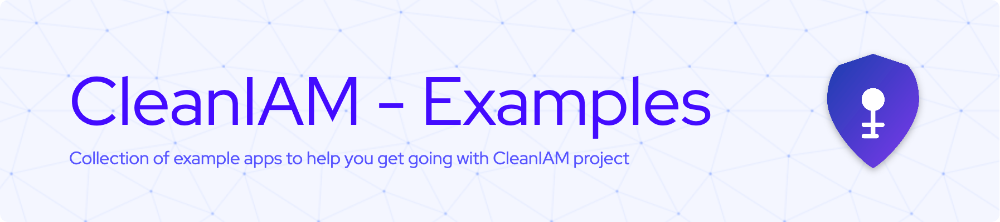

# CleanIAM Examples



A collection of example applications demonstrating how to integrate with the CleanIAM OpenID Connect server. These examples are designed to help developers quickly get started with CleanIAM in various tech stacks.

## 🌟 Examples

| Example                                           | Description                                                     | Tech Stack                 |
| ------------------------------------------------- | --------------------------------------------------------------- | -------------------------- |
| [React Frontend](example-apps/react_FE_example)   | Reference to the comprehensive Management Portal implementation | React 19, TypeScript, Vite |
| [Svelte Frontend](example-apps/svelte_FE_example) | Complete SvelteKit example with OIDC authentication             | SvelteKit, TypeScript      |
| [.NET Backend](example-apps/dotnet_BE_example)    | API example with token introspection and authorization          | .NET 8, C#                 |

## 🚀 Getting Started

Each example contains its own README with specific setup instructions. The general steps are:

1. Clone this repository

   ```bash
   git clone https://github.com/CleanIAM/CleanIAM-examples.git
   cd CleanIAM-examples
   ```

2. Set up the CleanIAM server locally or use a hosted instance

   - Link to the CleanIAM repository: [CleanIAM](https://github.com/CleanIAM/CleanIAM)

   ```bash
   # See the main CleanIAM repository for server setup instructions
   # https://github.com/CleanIAM/CleanIAM
   ```

3. Navigate to the example you want to try and follow the README instructions

## 🔑 Key Concepts

All examples demonstrate these core OIDC integration patterns:

### Authentication

- **Authorization Code Flow**: The recommended OAuth 2.0 flow with PKCE
- **Token Handling**: Secure storage and management of tokens
- **User Info**: Retrieving and using claims from ID tokens

### Authorization

- **API Protection**: Securing backend resources with JWT validation
- **Role-based Access**: Using claims and scopes for authorization decisions
- **Scope Validation**: Ensuring appropriate access based on granted scopes

### Integration

- **Token Refresh**: Automatically refreshing expired tokens
- **Error Handling**: Gracefully handling authentication failures
- **Logout Flows**: Implementing complete OIDC logout

## 📖 Learning Path

If you're new to OpenID Connect and CleanIAM, we recommend this learning path:

1. Start with the [CleanIAM Documentation](https://github.com/CleanIAM/CleanIAM)
2. Explore the examples in whatever order you need to:
   - Svelte Frontend (simplest implementation)
   - .NET Backend (securing APIs)
   - React Management Portal (comprehensive implementation)

## 🤝 Contributing

Contributions are welcome! If you'd like to add examples for other frameworks or improve existing ones:

## 📜 License

These examples are licensed under the MIT License - see the LICENSE file in each example for details.

## 🔗 Related Resources

- [CleanIAM Server](https://github.com/CleanIAM/CleanIAM) - The main OpenID Connect server
- [CleanIAM Management Portal](https://github.com/CleanIAM/CleanIAM-ManagementPortal) - Admin interface for CleanIAM
- [OpenID Connect Specs](https://openid.net/connect/) - Official OIDC specifications
- [OAuth 2.0 Specs](https://oauth.net/2/) - Official OAuth 2.0 specifications
